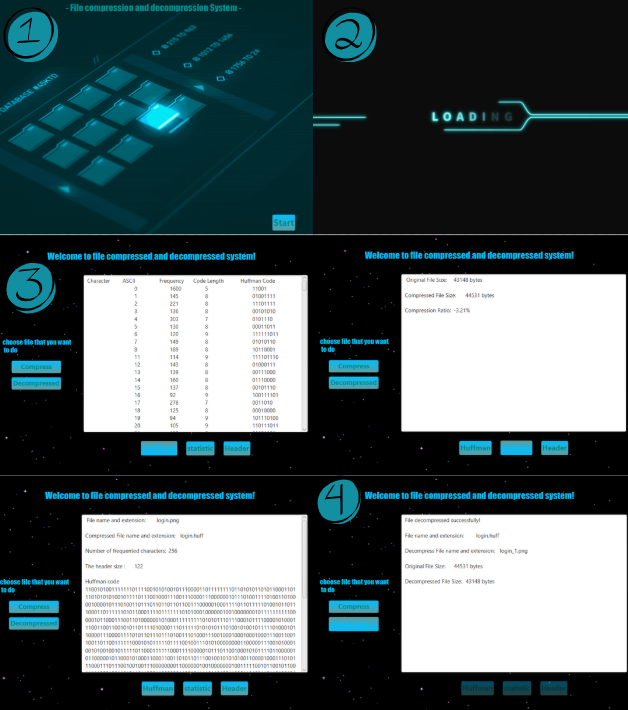

# File Compression and Decompression System 

This project is a **File Compression and Decompression System** implemented in **Java** using **JavaFX**. It uses **Huffman encoding** to compress and decompress files.

---

## 📌 Features
- Compress any file (except `.huff`) using Huffman encoding.
- Decompress `.huff` files back to their original format.
- Display Huffman table after compression.
- Show file statistics (original and compressed sizes).
- Display file header information.
- User-friendly GUI with:
  - Splash screen with animated GIF.
  - Loading screen with GIF animation.
  - Stylish buttons with hover effects.
  - Text area to show messages, tables, and statistics.

---

## ⚙️ Requirements
- **Java 8+** or later.
- **JavaFX** libraries.
- GIF images for splash/loading screens.
- `Hufman.java` and `HuffmanTable.java` classes available.

---

## 🚀 How to Run
1. Clone the repository or download the project files.
2. Make sure `Hufman.java` and `HuffmanTable.java` are in the same package (`application`).
3. Place the GIF images in the project directory.
4. Compile and run `Main.java` in an IDE that supports JavaFX (e.g., IntelliJ, Eclipse, or NetBeans).
5. Select a file to compress or decompress using the GUI.

---

## ⚠️ Notes
- Compression is not allowed for `.huff` files.
- Decompression works only for `.huff` files.
- Huffman table, statistics, and header buttons are enabled only after a successful compression.
- Errors or alerts are displayed using popup messages in the GUI.

---

## 🎨 UI Highlights
- Gradient buttons with hover effects.
- GIF animations for splash and loading screens.
- StackPane and VBox/HBox layouts for structured GUI.
- Non-editable TextArea for showing messages and tables.

---

## JavaFX Interface

